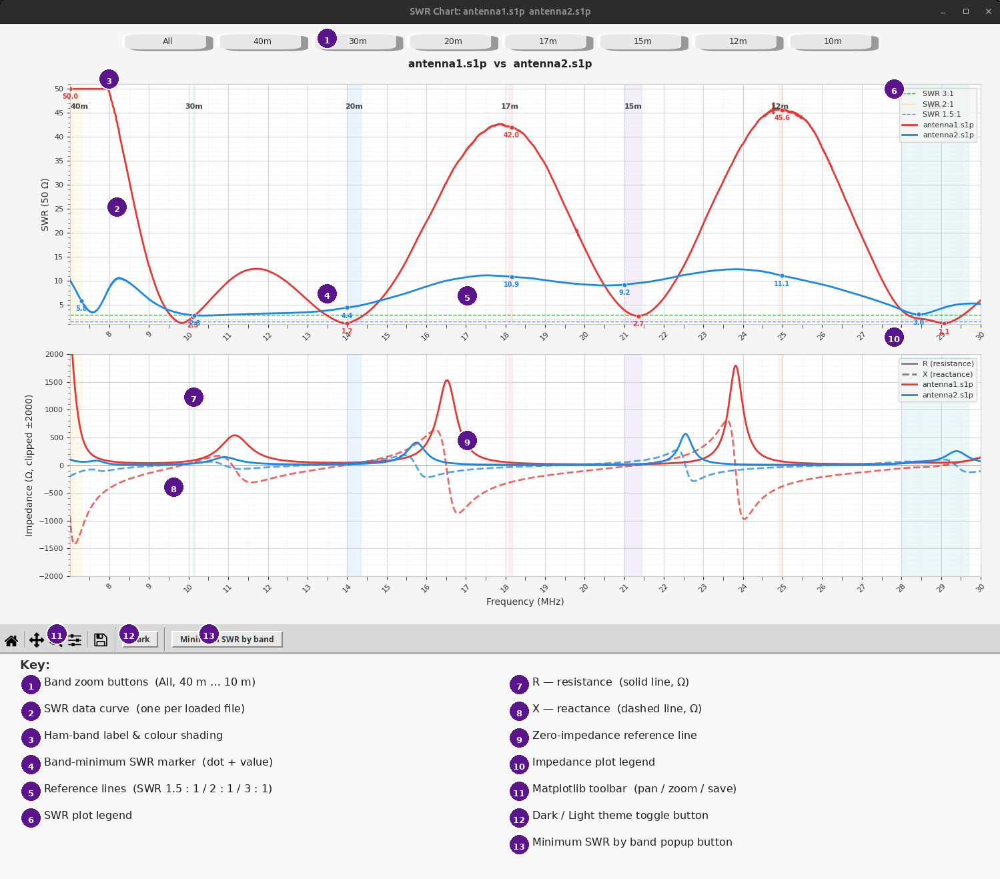
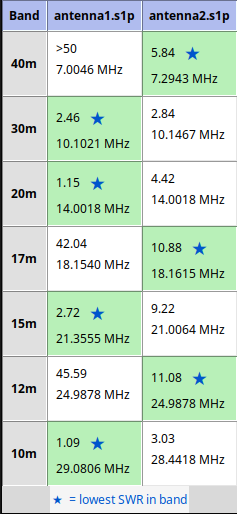
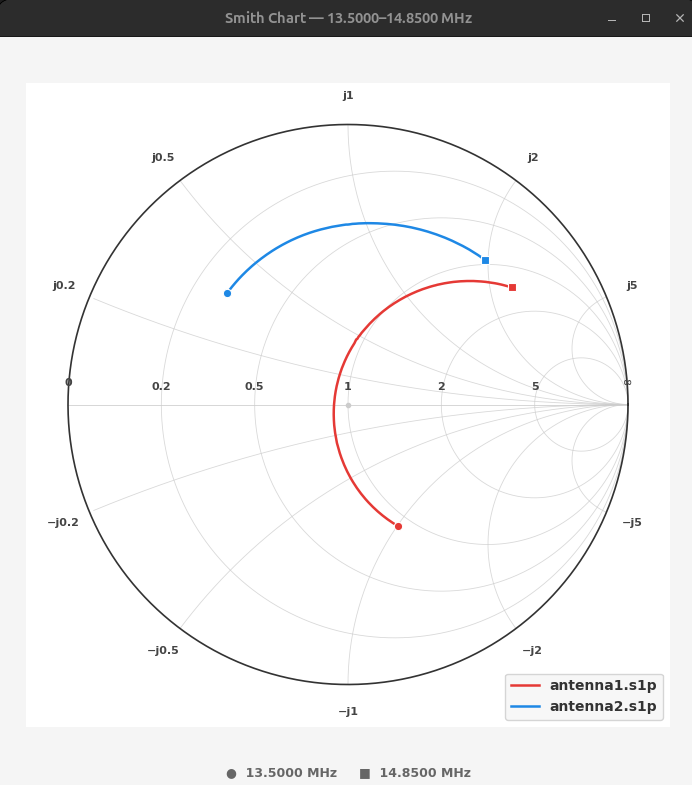

# swr_explore.py — NanoVNA SWR & Impedance Analyzer

An interactive viewer for NanoVNA (or other)`.s1p`(Touchstone) measurement files.
Load one or more files and explore SWR and impedance across all HF and VHF/UHF ham bands included in any of the .s1p files.
---

## Features at a Glance

- **Multi-file overlay** — load several `.s1p` files at once to compare antennas, feed lines, or balun configurations side by side
- **Dual-panel display** — SWR on top, impedance (R and X) on the bottom, sharing a common frequency axis
- **Min SWR popup** — a table comparing the best SWR in every band across all loaded files, with the winner in each band highlighted and marked with a blue ★
- **Smith Chart popup** — open a Smith Chart for the currently visible frequency range; multiple windows can be open simultaneously
- **Band shading** — each ham band is highlighted with a distinct color; band names are labeled at the top of the SWR plot
- **Band zoom buttons** — one-click zoom to any band. Buttons appear only for bands present in the loaded files
- **Impedance panel toggle** — hide the lower impedance panel so the SWR plot expands to fill the window; click again to restore it
- **SWR reference lines** — dashed guidelines at 1.5:1, 2:1, and 3:1 for quick visual assessment
- **Band minima markers** — a dot and SWR value are printed at the best (lowest) SWR point within each band for every file
- **Hover tooltip** — move the mouse over either plot to see exact frequency, SWR, and impedance (R + jX)
- **Pinned tooltips** — left-click to lock a tooltip in place; click the same spot again to remove it
- **Scroll-wheel zoom** — zoom in/out on the frequency axis, centered on the cursor position
- **Adaptive tick marks** — both X and Y tick spacing automatically adjust as you zoom in or out, so there are always readable numbers at any zoom level
- **Dark / Light theme toggle** — switch between a dark and light colour theme at any time using the light-bulb icon in the toolbar
- **Save figure** — the standard toolbar Save button saves to the current directory (not home)

---

#### The example figures below are from a doublet antenna, where the .s1p files are:
- `antenna1.s1p` — NanoVNA connected to a 1:1 balun (no tuner) to 300 Ω window line
- `antenna2.s1p` — NanoVNA connected through MFJ-993B tuner to 300 Ω window line (tuner off). Tuner has built-in 4:1 balun for the window line
#### 🔴 These files are present in the resources directory if you want to play with the tool and you dont have any .s1p files handy

## Usage

```bash
python3 swr_explore.py file1.s1p [file2.s1p ...]
```

| Argument | Description |
|---|---|
| `file1.s1p` | One or more Touchstone `.s1p` files exported from a NanoVNA |
| `--help` | Print usage information and exit |

Multiple files are overlaid on the same plots for side-by-side comparison. File names become the labels in the legend and the Min SWR table, so short descriptive names make the output easier to read.

```bash
# Single file — explore one antenna or feedline
python3 swr_explore.py antenna1.s1p

# Two files — compare before/after, or different balun configurations
python3 swr_explore.py 1to1_balun.s1p 4to1_balun.s1p

# Any number of files
python3 swr_explore.py config_a.s1p config_b.s1p config_c.s1p
```

---

## Window Layout



The title bar shows the names of all loaded files separated by `vs`.
Numbered callouts (1–15) in the image correspond to the key at the bottom of the image
and are described in detail in the sections below.

---

## The Band Button Row

- **All** — zooms out to show all bands included in any .s1p file
- **40m … 10m** — zooms to that band with padding on each side; buttons only appear for bands that have data
- Any band button also **auto-scales both Y axes** to fit the actual data within that frequency range, so weak features are not hidden by the full-range scale

---

## The Upper Plot — SWR

### What each element means

| Element | Description |
|---|---|
| **Colored curve** | SWR measured by the NanoVNA, one curve per loaded file. Line weight is 2 px so it stands out from the reference lines. SWR is clipped at 50 so extreme values don't compress the rest of the chart. |
| **Colored dot + number** | The lowest SWR point found within each ham band for that file. The number is the SWR value at that point. |
| **Green dashed line (3:1)** | The conventional "acceptable for most tuners" threshold. |
| **Orange dotted line (2:1)** | A common target for a well-matched antenna. |
| **Blue dashed line (1.5:1)** | Excellent match — most rigs are comfortable here without a tuner. |
| **Colored band spans** | Subtle background shading identifies each ham band. Band names are printed at the top of each span. |
| **Legend (upper right)** | Lists file names with their curve color. |

---

## The Lower Plot — Impedance

The antenna feed-point impedance has two components, both shown here for each loaded file:

| Line | Description |
|---|---|
| **Solid line — R (resistance, Ω)** | The real (resistive) part of the impedance. Includes both radiation resistance (power actually radiated) and any loss resistance. Peaks at anti-resonances; dips near resonances. |
| **Dashed line — X (reactance, Ω)** | The imaginary part. Positive = inductive (like a coil); negative = capacitive. Crosses zero at resonance — the steeper the crossing, the higher the Q. Large \|X\| means the antenna is far from resonance; the tuner must work harder to cancel it. |
| **Thin zero line** | Reference for X = 0. Resonance points are where the dashed X curve crosses this line. |
| **Legend (upper right)** | Shows which color is which file and distinguishes solid (R) from dashed (X) lines. |

Both R and X are clipped at ±2000 Ω for display purposes. When a value hits the clip limit, the hover tooltip notes *(clipped)*.

---

## Hover Tooltip

Move the mouse over either plot. A popup box tracks the nearest data point and shows:

```
14.1750 MHz  [20m]
SWR 1.87
Z = 312.4+148.3j Ω
```

- The frequency in MHz and which band it falls in (if any)
- The SWR at that point (`>50` if the value was clipped)
- The complex impedance Z = R + jX in Ω

The tooltip arrow flips to the left side automatically when the cursor is near the right edge of the plot.

---

## Pinned Tooltips

**Left-click** anywhere on either plot to lock the tooltip for that frequency in place. Pinned tooltips use a blue border to distinguish them from the hover tooltip. You can pin as many points as you like.

**Left-click the same spot** to remove a pin.

The toolbar **Home button** (⌂) clears all pins and resets the zoom simultaneously.

---

## The Min SWR Popup

Click **Minimum SWR by band** in the toolbar to open a comparison table:


- Each row is one ham band; each column is one loaded file
- Bands appear only if they are present in any loaded .s1p file
- Each cell shows the minimum SWR and the frequency where it occurs
- The cell with the **lowest SWR in each row** is highlighted green with a blue ★ to the right of the value
- The popup matches the current dark or light theme
- Clicking **Minimum SWR by band** again closes the old window and opens a fresh one

---

## The Smith Chart Popup

Click **Smith Chart** in the toolbar to open a Smith Chart for the currently visible frequency range.



- The chart shows the antenna impedance trace plotted as a reflection coefficient (Γ) on the standard normalised Smith Chart grid
- One trace is drawn per loaded file, in the same colours used in the main plots
- A **circle (●)** marks the lowest frequency in the visible range; a **square (■)** marks the highest
- The frequency range captured is shown below the chart
- Grid lines show constant-resistance circles (labelled 0.2, 0.5, 1, 2, 5) and constant-reactance arcs (labelled ±j0.2 through ±j5)
- **0** (left edge) = short circuit; **∞** (right edge) = open circuit; centre = perfect 50 Ω match
- **Hover tooltip** — move the mouse over the chart to see the frequency, SWR, and impedance (R + jX) at the nearest point on any trace
- Clicking **Smith Chart** again opens a **second independent window** — the previous one stays open. Each window captures the zoom level at the moment it was opened, so you can compare the same antenna across different frequency ranges side by side

### Reading the chart

| Position | What it means |
|---|---|
| Near the centre | Impedance close to 50 Ω — excellent match, low SWR |
| Near the outer rim | High SWR — large mismatch |
| Right half (positive X arc side) | Inductive reactance |
| Left half (negative X arc side) | Capacitive reactance |
| Crossing the real axis | Resonance — reactance passes through zero |
| Tight cluster | Narrow frequency range, impedance barely changing |
| Large loop | Wide impedance swing across the frequency range |

---

## Dark / Light Theme

Click the **light-bulb icon** in the toolbar (immediately after the Save button) to toggle the colour theme at any time:

- **Unlit bulb (outline)** — currently in light theme; click to switch to dark
- **Lit bulb (filled)** — currently in dark theme; click to switch to light

Everything updates instantly — plots, buttons, legends, tooltips, and the Min SWR popup all reflect the active theme.

---

## Zoom and Navigation Controls

| Action | Effect |
|---|---|
| **Scroll wheel up** | Zoom in on the frequency axis, centered on the cursor |
| **Scroll wheel down** | Zoom out |
| **Right-click** | Reset to full view, default Y scales |
| **Band buttons** | Zoom to that band; Y axes auto-scale to fit the data |
| **Toolbar ✛ (Pan)** | Click and drag to pan |
| **Toolbar 🔍 (Zoom)** | Rectangle zoom (drag to select) |
| **Toolbar ⌂ (Home)** | Reset zoom and clear all pinned tooltips |
| **Toolbar 💾 (Save)** | Save figure to the current directory; default filename is built from the loaded file names |
| **Toolbar 💡 (bulb icon)** | Toggle colour theme between light and dark |
| **Toolbar Impedance ▼/▲** | Hide or show the lower impedance panel; the SWR plot expands to fill when hidden |
| **Toolbar Minimum SWR by band** | Open the per-band minimum SWR comparison table |
| **Toolbar Smith Chart** | Open a Smith Chart for the visible frequency range |

Tick marks on both axes adapt automatically as you zoom — major and minor ticks
become finer when zoomed in and coarser when zoomed out, so there are always
readable numbers visible at any scale.

---

## Usage

```bash
# Single file
python3 swr_explore.py measurement.s1p

# Compare two configurations
python3 swr_explore.py 1to1.s1p withMFJ4to1.s1p

# Any number of files
python3 swr_explore.py config1.s1p config2.s1p config3.s1p
```

File names are used as labels throughout the display, so short descriptive
names make the charts easier to read.

### Supported .s1p formats

The parser handles all three standard Touchstone S-parameter formats:

| Format | Header token | Description |
|---|---|---|
| RI | (default) | Real + imaginary parts of S11 |
| MA | `MA` | Magnitude + angle (degrees) |
| DB | `DB` | dB magnitude + angle (degrees) |

The reference impedance (`R 50` in the header) is read automatically; any
value other than 50 Ω is handled correctly.

---

## Installation

Python 3.8 or later is required.

### Dependencies

| Package | Purpose |
|---|---|
| `numpy` | Array math for S-parameter parsing and SWR computation |
| `matplotlib` | All plotting, the interactive figure window, and toolbar |
| `tkinter` | GUI backend for the figure window, Min SWR popup, and theme toggle (usually bundled with Python) |

### Install with pip

```bash
pip install numpy matplotlib
```

`tkinter` is part of the Python standard library on most systems. If it is
missing (common on minimal Linux installs), install it via your package manager:

```bash
# Debian / Ubuntu / Raspberry Pi OS
sudo apt install python3-tk

# Fedora / RHEL
sudo dnf install python3-tkinter

# Arch
sudo pacman -S tk
```

### Virtual environment (recommended)

```bash
python3 -m venv venv
source venv/bin/activate
pip install numpy matplotlib
python3 swr_explore.py your_file.s1p
```

This installs the necessary modules in the venv directory only, so the system-wide Python libraries are not affected.
